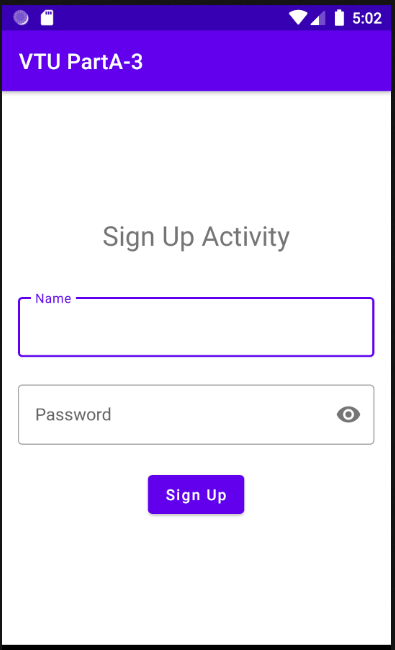

# MOBILE APPLICATION DEVELOPEMENT 

# Programme 3 (PartA-3)

  Create a SIGN Up activity with Username and Password. Validation of password should happenbased on the following rules: 
&nbsp; &nbsp;&nbsp;•	Password should contain uppercase and lowercase letters. 
&nbsp; &nbsp;&nbsp;•	Password should contain letters and numbers. 
 &nbsp; &nbsp;&nbsp;•	Password should contain special characters. 
&nbsp; &nbsp;&nbsp;•	Minimum length of the password (the default value is 8). 

On successful SIGN UP proceed to the next Login activity. Here the user should SIGN IN using the Username and Password created during signup activity. If the Username and Password are matched then navigate to the next activity whichdisplays a message saying “Successful Login” or else display a toast message saying “Login Failed”.The user is given only two attempts and after thatdisplay a toast message saying “Failed Login Attempts” and disable the SIGN IN button. Use Bundle to transfer information from one activity to another.
  

